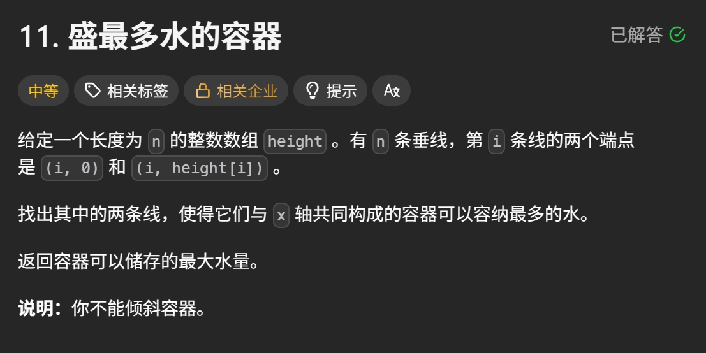

Leetcode Hot 100 第五篇，来到这道双指针经典代表作：**盛最多水的容器**。

这题表面像几何，实则是个很典型的“**抓住决定因素，然后用双指针缩范围**”的题。

很多人第一次看会忍不住想：

- 要不要枚举两条线？
- 要不要算很多种组合？
- 要不要找最高的柱子？

结果绕一圈回来会发现：

> **真正决定这桶水能装多少的，不是高的那根板子，而是短的那根。**

这就是这题最关键的四个字：**短板效应**。

## 题目链接

[LeetCode 11. 盛最多水的容器](https://leetcode.cn/problems/container-with-most-water/description/?envType=study-plan-v2&envId=top-100-liked)

## 题目描述

给定一个长度为 `n` 的整数数组 `height`。
有 `n` 条垂线，第 `i` 条线的两个端点是 `(i, 0)` 和 `(i, height[i])`。

找出其中的两条线，使得它们与 `x` 轴共同构成的容器可以容纳最多的水。

返回容器可以储存的最大水量。

说明：你不能倾斜容器。



## 先想明白：面积怎么算？

任意选两根柱子，假设下标分别是：

- `left`
- `right`

那它们能装的水量就是：

```python
(right - left) * min(height[left], height[right])
```

这里有两个量：

### 1. 宽度

```python
right - left
```

两根柱子离得越远，底越宽。

### 2. 高度

```python
min(height[left], height[right])
```

容器高度取决于较矮的那根柱子。

因为再高的那一边，也挡不住水从矮的那边漏出去。

所以：

> **面积 = 宽度 × 短板高度**

这就是这题全部逻辑的发源地。

## 为什么用相向双指针

如果暴力枚举所有两根柱子的组合，
那就是两层循环，时间复杂度：

```python
O(n^2)
```

这显然不够优雅。

更聪明的办法是：

- 一开始把两根指针放在最两边
- 因为这样宽度最大
- 然后每次计算当前面积
- 再移动较矮的那根柱子对应的指针

也就是：

- `left` 从左边出发
- `right` 从右边出发
- 两边往中间收

这就是所谓的**相向双指针**。

## 为什么只能移动短板

这是整题最核心的地方。

假设当前：

```python
height[left] < height[right]
```

说明左边更短，左边是短板。

当前面积是：

```python
(right - left) * height[left]
```

这时候如果你去移动右边那个更高的柱子，会发生什么？

- 宽度一定变小了
- 高度上限仍然受左边短板限制

也就是说：

- 宽变窄了
- 短板没变高

那面积不可能因此变得更优。

所以，移动高板没有意义。

只有移动短板，才有可能遇到一根更高的柱子，
从而让“短板高度”变大，给更大面积留下可能。

一句话总结就是：

> **宽度收缩是不可避免的，所以只能指望短板变高来翻盘。**

## 代码实现

```python
class Solution(object):
    def maxArea(self, height):
        """
        :type height: List[int]
        :rtype: int
        """
        left, right = 0, len(height) - 1
        ans = 0

        while left < right:
            ans = max(ans, (right - left) * min(height[left], height[right]))
            if height[left] < height[right]:
                left += 1
            else:
                right -= 1

        return ans
```

## 代码解析

### 1. 初始化左右指针

```python
left, right = 0, len(height) - 1
```

一开始让左右指针站在数组两端。

这样做的原因是：

- 初始宽度最大
- 后续再慢慢缩小范围

### 2. 记录答案

```python
ans = 0
```

用来保存目前见过的最大面积。

### 3. 只要左右没有相遇，就继续计算

```python
while left < right:
```

因为至少要两根柱子，
当两个指针相遇时，就没法再形成容器了。

### 4. 计算当前容器面积

```python
ans = max(ans, (right - left) * min(height[left], height[right]))
```

这一步就是套公式：

- 宽度：`right - left`
- 高度：`min(height[left], height[right])`

然后和当前最大值比较，取更大的。

### 5. 移动短板对应的指针

```python
if height[left] < height[right]:
    left += 1
else:
    right -= 1
```

这是整题的灵魂操作。

- 如果左边更矮，就移动左指针
- 否则移动右指针

因为只有移动短板，才可能遇到更高的板子，
让容器高度上限变大。

## 示例推演

来看经典样例：

```python
height = [1,8,6,2,5,4,8,3,7]
```

### 初始状态

```python
left = 0
right = 8
```

两边高度分别是：

```python
height[left] = 1
height[right] = 7
```

当前面积：

```python
(8 - 0) * min(1, 7) = 8
```

最大值更新为：

```python
ans = 8
```

因为左边更短，所以左指针右移。

### 第二轮

```python
left = 1
right = 8
```

两边高度：

```python
8 和 7
```

当前面积：

```python
(8 - 1) * min(8, 7) = 7 * 7 = 49
```

更新答案：

```python
ans = 49
```

这已经是这组样例的最优解。

接下来继续按照“移动短板”的规则缩小范围，
虽然还会检查很多种可能，
但都不会超过 `49`。

最终返回：

```python
49
```

## 为什么这方法正确

这题的正确性核心在于“舍弃无效状态”。

当左右指针固定时，当前面积已经确定：

```python
(right - left) * min(height[left], height[right])
```

假设左边更短。

那么：

- 当前短板是 `height[left]`
- 如果右指针左移，宽度会减小
- 但短板上限还是不可能超过左边这块短板带来的限制

因此，移动右指针不会让当前这条左板对应的答案更优。

既然如此，就可以放心丢掉它，去尝试移动左指针。

也就是说，双指针不是在乱试，
而是在依据“短板决定上限”这个原则，
一步步排除不可能更优的组合。

## 复杂度分析

### 时间复杂度

左右指针最多各移动 `n` 次，
所以总时间复杂度是：

```python
O(n)
```

### 空间复杂度

只用了几个变量，空间复杂度是：

```python
O(1)
```

## 你这版“跳过更矮柱子”的写法是什么思路

你给的代码是这样的：

```python
class Solution(object):
    def maxArea(self, height):
        """
        :type height: List[int]
        :rtype: int
        """
        left, right = 0, len(height)-1
        ans = 0
        while left < right:
            ans = max(ans, (right-left)*min(height[left], height[right]))
            if height[left] < height[right]:
                t = left + 1
                while t < right and height[t] < height[left]:
                    t += 1
                left = t
            else:
                t = right - 1
                while t > left and height[t] < height[right]:
                    t -= 1
                right = t
        return ans
```

这其实是在标准双指针基础上，加入了一层剪枝理解：

- 如果当前左边是短板
- 那么向右移动左指针时
- 比当前左板还矮的柱子，通常没必要一根根慢慢试
- 因为它们既让宽度变小，又不会让短板高度变高

所以可以直接跳过去。

这个思路是能讲通的，
也属于对短板效应理解更进一步的一种写法。

不过在博客主线里，我还是更推荐先掌握标准版：

- 代码更短
- 逻辑更稳
- 面试更好解释

等把基本版吃透之后，
再看这种“跳过无效短板”的优化，会更顺。

## 这种写法的关键点

### 1. 面积不是看高板，而是看短板

高板再高，短板不抬头，水位也上不去。

### 2. 每次缩范围时，必须移动短板

因为只有短板变高，才有机会抵消宽度变小带来的损失。

### 3. 双指针不是瞎碰运气，而是在做有依据的排除

这题双指针之所以成立，
核心就是我们知道哪些状态不可能更优。

## 小结

这题很适合拿来理解双指针里一个非常经典的套路：

> **当答案由两个因素共同决定时，要抓住那个真正卡上限的因素。**

在这道题里，卡上限的就是短板。

所以如果只记一句话，那就是：

> **想装更多水，别盯高板发呆，要盯短板想办法。**

Hot 100 第五篇，继续推进。
题海里有些题靠技巧，有些题靠悟性，这题属于那种——一旦悟到短板效应，后面就顺得像水自己找低处流。🦐
