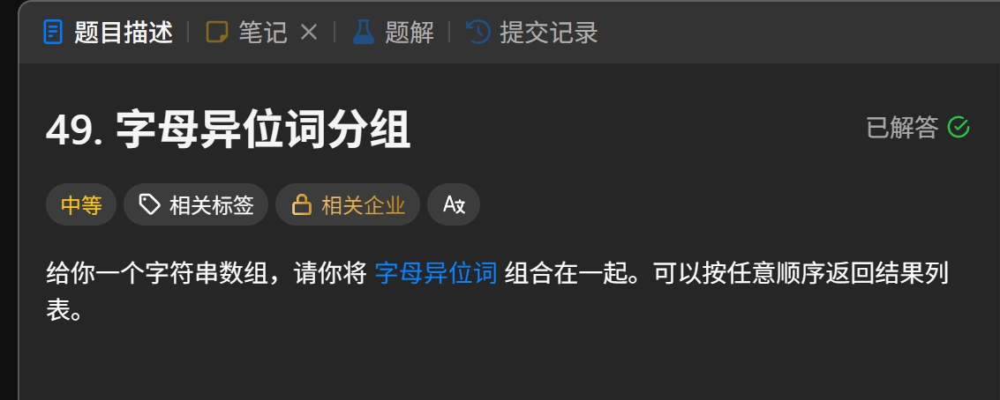

Leetcode Hot 100 第二篇，轮到这道看着像字符串题、骨子里其实很哈希的老朋友：**字母异位词分组**。

这题不靠花活，核心就一句话：

> **只要两个字符串排序后长得一样，它们就是一组。**

说白了，字母顺序可以乱，字母成分不能变。
像 `eat`、`tea`、`ate` 这种，虽然站位不同，但本质上都是同一锅字母炒出来的菜。

## 题目链接

[LeetCode 49. 字母异位词分组](https://leetcode.cn/problems/group-anagrams/description/?envType=study-plan-v2&envId=top-100-liked)

## 题目描述

给你一个字符串数组，请你将 **字母异位词** 组合在一起，可以按任意顺序返回结果列表。



### 什么是字母异位词？

所谓字母异位词，就是：

- 用到的字母完全一样
- 每个字母出现的次数也完全一样
- 只是排列顺序不同

比如：

- `eat`、`tea`、`ate` 是一组
- `tan`、`nat` 是一组
- `bat` 自己单独一组

## 解题思路：字典分组

这题最顺手的办法，就是用一个字典来做分组。

思路分成两步：

1. 遍历每个字符串
2. 把这个字符串排序后得到的新字符串，当作字典的键

为什么这样能行？

因为：

- `eat` 排序后是 `aet`
- `tea` 排序后也是 `aet`
- `ate` 排序后还是 `aet`

既然它们排完序都长一个样，那自然应该被放进同一个桶里。

这题的灵魂，不在“原字符串长啥样”，而在：

> **排序之后，它露出了真面目。**

## 代码实现

```python
class Solution(object):
    def groupAnagrams(self, strs):
        """
        :type strs: List[str]
        :rtype: List[List[str]]
        """
        str_dict = {}
        for i in strs:
            t = ''.join(sorted(i))
            # 如果没有该键，初始化为空列表
            if t not in str_dict:
                str_dict[t] = []
            str_dict[t].append(i)
        return list(str_dict.values())
```

## 代码解析

我们一行一行拆开看。

### 1. 准备一个字典

```python
str_dict = {}
```

这个字典用来存“分组结果”。

- 键：字符串排序后的结果
- 值：属于这一组的所有原字符串

比如最后它可能长这样：

```python
{
    "aet": ["eat", "tea", "ate"],
    "ant": ["tan", "nat"],
    "abt": ["bat"]
}
```

### 2. 遍历每个字符串

```python
for i in strs:
```

把数组里的每个单词都拿出来处理。

### 3. 生成分组键

```python
t = ''.join(sorted(i))
```

这是整题最关键的一步。

先看 `sorted(i)`：

- 它会把字符串里的字符拆开并排序
- 比如 `eat` 会变成 `['a', 'e', 't']`

再用：

```python
''.join(...)
```

把排序后的字符重新拼回字符串，得到：

```python
"aet"
```

这个 `t` 就是我们用来分组的“身份证”。

只要两个字符串的 `t` 一样，它们就属于同一类。

### 4. 如果键不存在，就先创建空列表

```python
if t not in str_dict:
    str_dict[t] = []
```

这是典型的字典初始化操作。

意思是：

- 如果当前这个分组还没出现过
- 那就先给它准备一个空列表
- 等会儿把字符串塞进去

### 5. 把当前字符串放进对应分组

```python
str_dict[t].append(i)
```

这一步很直接：

- `eat` 的键是 `aet`，就放进 `str_dict["aet"]`
- `tea` 的键也是 `aet`，继续放进去
- `ate` 还是 `aet`，接着放进去

于是它们仨就成功会师了。

### 6. 返回所有分组结果

```python
return list(str_dict.values())
```

字典的值就是每个分组对应的列表。

我们不需要键本身，只要所有分好的组，直接返回：

```python
[["eat", "tea", "ate"], ["tan", "nat"], ["bat"]]
```

顺序不重要，题目允许任意顺序返回。

## 示例推演

假设输入是：

```python
strs = ["eat", "tea", "tan", "ate", "nat", "bat"]
```

遍历过程大概是这样：

### 处理 `eat`

排序后：

```python
"aet"
```

字典变成：

```python
{
    "aet": ["eat"]
}
```

### 处理 `tea`

排序后还是：

```python
"aet"
```

字典变成：

```python
{
    "aet": ["eat", "tea"]
}
```

### 处理 `tan`

排序后：

```python
"ant"
```

字典变成：

```python
{
    "aet": ["eat", "tea"],
    "ant": ["tan"]
}
```

### 处理 `ate`

排序后还是 `aet`：

```python
{
    "aet": ["eat", "tea", "ate"],
    "ant": ["tan"]
}
```

### 处理 `nat`

排序后也是 `ant`：

```python
{
    "aet": ["eat", "tea", "ate"],
    "ant": ["tan", "nat"]
}
```

### 处理 `bat`

排序后是 `abt`：

```python
{
    "aet": ["eat", "tea", "ate"],
    "ant": ["tan", "nat"],
    "abt": ["bat"]
}
```

最后返回所有值即可。

## 为什么这方法可行

因为字母异位词有一个非常稳定的特征：

> **字符排序后结果完全一致。**

这个性质非常适合拿来做哈希键。

也就是说，这题本质不是在比较两个字符串“像不像”，
而是在找一个能代表这类字符串的统一标识。

排序后的字符串，刚好就能担任这个角色。

## 复杂度分析

设：

- 字符串个数为 `n`
- 每个字符串的平均长度为 `k`

那么：

### 时间复杂度

每个字符串都要排序一次。

单次排序复杂度是：

```python
O(k log k)
```

一共有 `n` 个字符串，所以总时间复杂度是：

```python
O(n * k log k)
```

### 空间复杂度

字典要存所有字符串分组结果，所以空间复杂度为：

```python
O(n * k)
```

如果只按刷题语境简单记，也常写成：

```python
O(n)
```

但更严谨一点，还是要把字符串内容占用考虑进去。

## 这种写法的优点

### 1. 思路直观

一眼就能看懂：

- 排序
- 找键
- 丢进字典
- 返回结果

没有弯弯绕绕，特别适合建立哈希分组的感觉。

### 2. 代码短，面试也好讲

这类题最怕自己写着写着把人绕晕。
这个解法结构清晰，解释起来也顺手。

### 3. 通用性强

以后碰到“把某类对象按某个统一特征归类”的题，
也很容易想到：

> **能不能先提炼一个键，再用字典分桶？**

这是比这道题本身更值得带走的东西。

## 小结

这题的关键不在于“分组”两个字，
而在于你能不能找到一个稳定的分组依据。

这里的答案就是：

> **把字符串排序后的结果，当作字典键。**

于是整题就从“看起来像字符串分类题”，
丝滑变成了“标准哈希表分组题”。

如果只记一句话，那就是：

> **异位词会伪装，排序后原形毕露。**

Hot 100 第二篇，继续开刷。
题不一定都难，但每刷一道，脑子里的路就更宽一点。🦐
