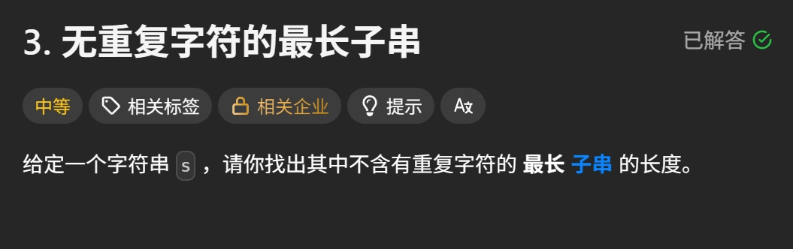

Leetcode Hot 100 第八篇，来到滑动窗口题里的经典入门款：**无重复字符的最长子串**。

这题看起来像字符串题，
实际上更像是在问你：

> **能不能维护一个“始终合法”的窗口，并在移动过程中不断更新答案。**

这里所谓的“合法”，就是：

- 窗口里的字符都不能重复

一旦有重复字符混进来，
窗口就得收缩，直到它重新变干净。

## 题目链接

[LeetCode 3. 无重复字符的最长子串](https://leetcode.cn/problems/longest-substring-without-repeating-characters/?envType=study-plan-v2&envId=top-100-liked)

## 题目描述

给定一个字符串 `s`，请你找出其中不含有重复字符的**最长子串**的长度。



### 注意：这里是“子串”，不是“子序列”

- **子串**：必须连续
- **子序列**：可以不连续

这题要的是连续的一段，
所以非常适合用滑动窗口来做。

## 解题思路：滑动窗口 + 哈希计数

你给的思路主线完全正确：**双指针 / 滑动窗口**。

不过有个小地方要说清：

你文字里写的是“`hashset`”，
但这份代码实际用的是：

```python
Counter()
```

也就是说，这版并不是纯集合写法，
而是更准确的：

> **滑动窗口 + 哈希表计数**

它的核心逻辑是：

- `right` 不断向右扩展窗口
- 每加入一个字符，就把它的出现次数加一
- 如果某个字符出现次数大于 `1`，说明窗口不合法了
- 这时不断移动 `left`，把窗口缩小，直到重复字符被清掉
- 每次窗口恢复合法后，更新最大长度

## 代码实现

```python
from collections import Counter

class Solution(object):
    def lengthOfLongestSubstring(self, s):
        """
        :type s: str
        :rtype: int
        """
        counter = Counter()
        n = len(s)
        left = 0
        ans = 0

        for right in range(n):
            counter[s[right]] += 1

            while left <= right and counter[s[right]] > 1:
                # 注意这里要先减计数，再移动 left
                counter[s[left]] -= 1
                left += 1

            ans = max(ans, right - left + 1)

        return ans
```

## 代码解析

### 1. `counter` 记录窗口内每个字符出现了几次

```python
counter = Counter()
```

这个哈希表的作用是：

- 键：字符
- 值：该字符在当前窗口中出现的次数

比如当前窗口是：

```python
"abca"
```

那么：

```python
counter = {
    'a': 2,
    'b': 1,
    'c': 1
}
```

一眼就能看出：

- `a` 重复了
- 当前窗口不合法

### 2. `right` 负责把窗口往右扩张

```python
for right in range(n):
    counter[s[right]] += 1
```

每次遍历到一个新字符，
就把它纳入窗口。

这一步相当于说：

> “先把这个字符收进来，再看窗口还合不合法。”

### 3. 一旦出现重复，就不断收缩左边界

```python
while left <= right and counter[s[right]] > 1:
    counter[s[left]] -= 1
    left += 1
```

这是整题最关键的一步。

为什么判断条件写成：

```python
counter[s[right]] > 1
```

因为当前新加入窗口、导致问题出现的，就是 `s[right]`。

如果它的出现次数大于 `1`，
说明当前窗口里有重复字符，必须收缩。

收缩时要注意顺序：

1. 先把 `s[left]` 的计数减一
2. 再把 `left` 右移

这个顺序很重要。

如果顺序反了，逻辑就会拧巴，
甚至可能把计数维护错位。

### 4. 窗口合法后更新答案

```python
ans = max(ans, right - left + 1)
```

当 `while` 结束时，
说明当前窗口已经重新变成“不含重复字符”的合法窗口。

这时窗口长度就是：

```python
right - left + 1
```

拿它和历史最大值比较，更新答案即可。

## 示例推演

来看最经典的例子：

```python
s = "abcabcbb"
```

### 初始状态

- `left = 0`
- `ans = 0`
- 窗口为空

### `right = 0`，加入 `'a'`

窗口变成：

```python
"a"
```

没有重复，长度为 `1`。

```python
ans = 1
```

### `right = 1`，加入 `'b'`

窗口变成：

```python
"ab"
```

没有重复，长度为 `2`。

```python
ans = 2
```

### `right = 2`，加入 `'c'`

窗口变成：

```python
"abc"
```

没有重复，长度为 `3`。

```python
ans = 3
```

### `right = 3`，加入 `'a'`

窗口变成：

```python
"abca"
```

此时 `'a'` 重复了。

开始收缩左边界：

- 移除左边第一个 `'a'`
- `left` 从 `0` 移到 `1`

窗口重新变成：

```python
"bca"
```

又合法了，长度还是 `3`。

### 后面继续同理

窗口会不断经历：

- 右边扩张
- 出现重复
- 左边收缩
- 恢复合法

最终最长长度就是：

```python
3
```

## 为什么滑动窗口适合这题

因为这题要找的是：

> **一段连续区间里，不含重复字符的最长长度。**

连续区间 + 动态维护合法性，
就是滑动窗口最擅长的活。

它的优势在于：

- 不需要枚举所有子串
- 不需要每次都重新检查整段是否重复
- 只在窗口边界变化时，增量维护状态

所以效率会高很多。

## 复杂度分析

### 时间复杂度

虽然看起来有一层 `for` 和一层 `while`，
但 `left` 和 `right` 都只会从左到右各走一遍。

所以总时间复杂度是：

```python
O(n)
```

### 空间复杂度

哈希表最多记录字符集中的若干字符，
一般记作：

```python
O(k)
```

其中 `k` 是字符集大小。

如果按字符串长度上界来写，也可以记成：

```python
O(n)
```

## 这题也可以用 hash set 吗？

可以。

这题非常常见的另一种写法，是：

- 用 `set` 维护当前窗口中有哪些字符
- 如果 `s[right]` 已经在集合里
- 就不断移动 `left`，并把左边字符从集合中删掉
- 直到窗口重新不重复

那种写法也很经典。

但你这版 `Counter` 有一个好处：

> **逻辑更通用。**

以后遇到“允许重复几次”“统计窗口内频率”“判断窗口内某字符数量是否超标”之类的问题，
`Counter` 这套会更顺手。

## 这种写法的关键点

### 1. 窗口不合法时，不是推倒重来，而是慢慢缩

滑动窗口的魅力就在这：

- 能扩就扩
- 不合法就缩
- 没必要把整个窗口作废重建

### 2. 重复的判断依赖计数，不只是看存不存在

这也是为什么这版本质上是“哈希计数”，而不是纯 `set`。

### 3. 更新答案必须在窗口恢复合法之后

如果窗口里还有重复字符就去更新长度，
那答案就会掺水。

## 小结

这题表面上是在找“最长子串”，
本质上是在练：

> **如何维护一个始终合法的滑动窗口。**

而你这版解法的核心流程其实就四步：

- 右指针扩张
- 哈希计数更新
- 出现重复就左指针收缩
- 窗口合法后更新答案

如果只记一句话，那就是：

> **窗口能扩就扩，字符一重就缩，始终把窗口维持在“无重复”的合法状态。**

Hot 100 第八篇，继续推进。
这题不算难，但特别适合拿来练滑动窗口的手感——窗子别乱开，字符别重来，长度自然就出来。🦐
